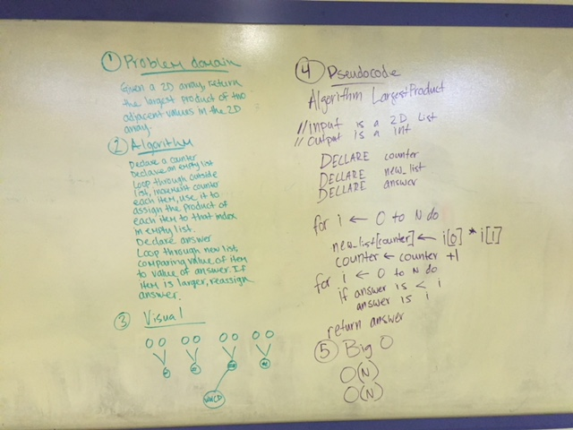

# Largest Product

Once you know a little more about lists, being able to use for loops to iterate through multiple lists becomes easier!

## Challenge
Write a function called LargestProduct which takes in a 2D array. Without utilizing any of the built-in methods available to your language, return the largest product of 2 adjacent values within the 2D array.

## Solution

