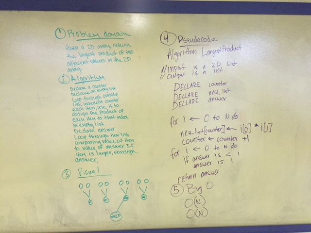

# Largest Product

I know nothing about lists and how to manipulate them... face palm

## Challenge
Write a function called LargestProduct which takes in a 2D array. Without utilizing any of the built-in methods available to your language, return the largest product of 2 adjacent values within the 2D array.

## Solution

