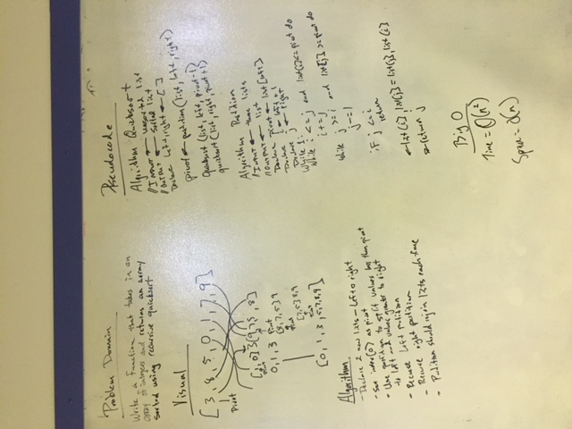

# Quicksort

The only thing quick about this assignment was my willingness to walk away until tomorrow...

## Challenge

Feature Tasks
- Write a function that accepts an array of integers, and returns an array sorted by a recursive quicksort algorithm.

Structure and Testing
- Utilize the Single-responsibility principle: any methods you write should be clean, reusable, abstract component parts to the whole challenge. 

- Write at least three test assertions for each method that you define.

- Ensure your tests are passing before you submit your solution.

## Solution

### Resources

The internets
