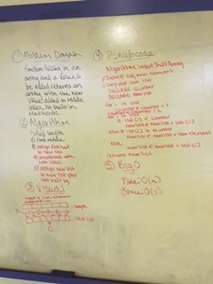

# Insert and shift middle index of array

Learn to step away from your tools and do it just like the original cavemen - without any helper functions!

## Challenge
Write a function called insertShiftArray which takes in an array and the value to be added. Without utilizing any of the built-in methods available to your language, return an array with the new value added at the middle index.

## Solution

