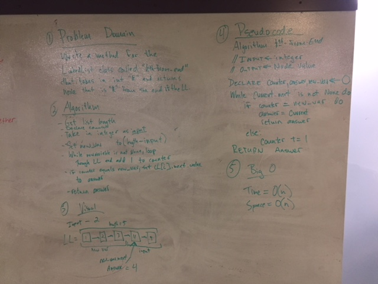

# Linked List Kth-From-End

What if you just want to fit in? That's why we have Kth-From-End!

## Challenge
Write a method for the Linked List class called kthFromEnd which takes a number, k, as an argument. Return the node that is k from the end of the linked list. You have access to the Node class and all the properties on the Linked List class as well as the methods created in previous challenges.

## Solution

